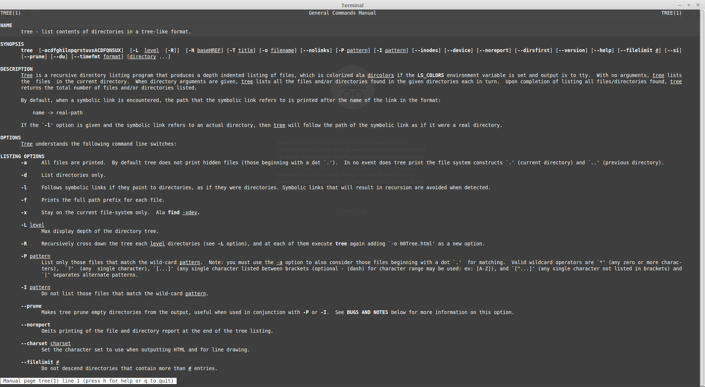

Additions to How To Answer Questions in a Helpful Way
* Try to find an answer based on what you know about similar problems
* Try to find an answer by taking a break from the problem and coming back to it later

What I got out of Chapter 3 of Free Culture

While I had always known that the RIAA had a history of punishing young adults heavily for percieved piracy, I had not heard of this particular instance. In this case they weren't even going after a file hoster, but the man who made the search engine. This is absurd on all levels and it is no wonder that Jesse became an activist due to it. The fact that the RIAA can do this is a clear example of our copyright and communication laws are outdated by technology. I understand the need to protect properties, but these cases are far removed from the plight of artists and creators.

Screenshot of Tree: 
